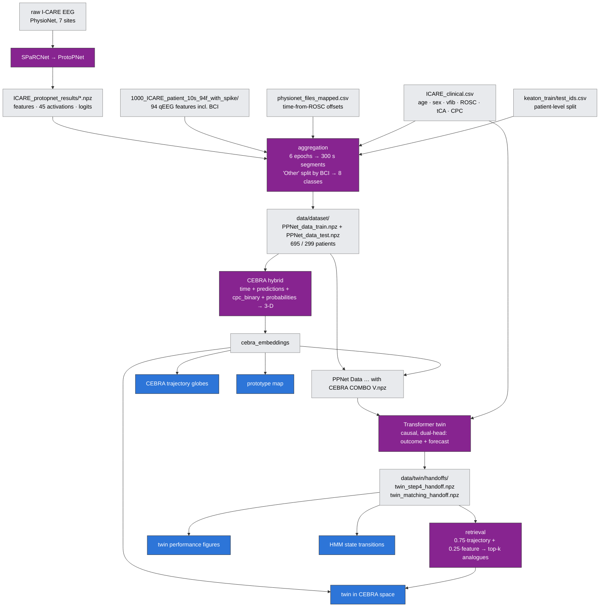

# EEG-Twin — full pipeline

From raw EEG to the manuscript figures. Purple = models, grey = data artifacts,
blue = figures.

## The three models

| Model | In | Out |
|---|---|---|
| **SPaRCNet → ProtoPNet** | raw EEG epochs | 6-class IIIC + 45 prototype activations |
| **CEBRA hybrid** | 50-d PCA of ProtoPNet features + 13 qEEG | 3-D trajectory embedding |
| **Transformer twin** | 98-d hourly summaries + 5 clinical covariates | per-block P(good), next-block forecast, 256-d hidden state |

The 6 → 8 class step is not a model: `Other` is split by the burst-suppression
index into BurstSupp (BCI < 0.5), Discontinuous (0.5–0.9), Continuous (≥ 0.9).

## Status

| Branch | State |
|---|---|
| raw EEG → ProtoPNet outputs | training code not in this repo; its outputs are the pipeline's input |
| ProtoPNet outputs → `PPNet_data_*.npz` | wired as the build-dataset step; never executed |
| `PPNet_data_*.npz` → CEBRA → figures | **verified end to end, bit-reproducible** |
| `… with CEBRA COMBO V.npz` → twin → figures | **verified on a 4-patient smoke run**; full cohort never run |

CEBRA supervises on `cpc_binary` during **training only** — the encoder is
`f(X) → 3-D`, so no label enters the forward pass at inference.
